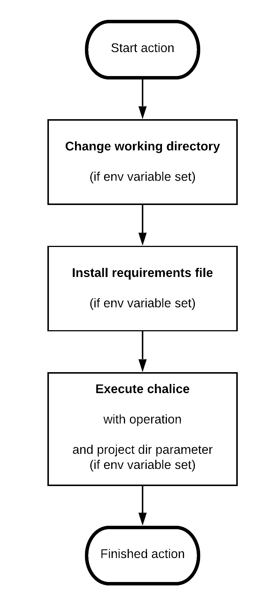

# Chalice Extended Action

This Github action allows automated deployment of your Chalice application via Github Actions.


You don't know what Chalice is?

To put it in a nutshell: Python Serverless Microframework for AWS

Link: [https://github.com/aws/chalice](https://github.com/aws/chalice)

## Parameters

The parameters will be passed to the action by using environment variables.

| Name  | Description  | Required?  |
|---|---|---|
| WORKING_DIRECTORY  | Working directory of chalice in which the chalice project is or should be stored  | Optional  |
| REQUIREMENTS_FILE  | Path to a requirements file which should be installed before handling the chalice project  | Optional  |
| PROJECT_DIR  | Path to a directory which contains a chalice project  | Optional  |
| STAGE  | Name of stage which should be used | Optional  |
| OPERATION  | Chalice operation  | Required  |


## Usage

1. Create a directory named `.github/workflow/`

2. Create a YAML file, e.g. action_workflow.yml, and place it in the created directory above

3. Example content of the YAML file:

```
on:
  push:
    branches:
      - master
name: Deploy branch to Chalice
jobs:
  deploy:
    name: deploy
    runs-on: ubuntu-latest
    steps:
    - uses: actions/checkout@master
    - name: chalice deploy
      uses: jayef0/chalice-extended-action@v0.1.0
      env:
        WORKING_DIRECTORY: backend/chalice
        REQUIREMENTS_FILE: requirements.prod.txt
        OPERATION: deploy
        STAGE: dev
        AWS_ACCESS_KEY_ID: ${{ secrets.AWS_ACCESS_KEY_ID }}
        AWS_SECRET_ACCESS_KEY: ${{ secrets.AWS_SECRET_ACCESS_KEY }}
        AWS_DEFAULT_REGION: us-east-1
```

## Functionality

A short overview of the execution process:



## Secrets

The recommendation is to set the AWS credentials as GitHub secrets in your GitHub repository.
